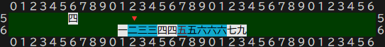
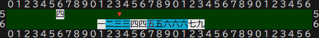
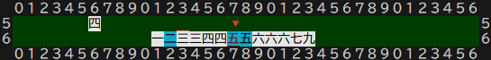

# 牌選択処理

## チーしたときの動作
1. 
2. 
3. 
- (チーよりポンやカンの方が優先なのでキャンセルを確認後に以下の処理をする)
- 選択可能牌はシアン色で表示 移動可能牌にだけ選択移動できる
- 選択可能牌を表示初期は最左端にマーク🔻を設定(図1)
- 端に達してそれ以上移動できない場合は入力を無視する(トグルしない)
- 第一牌を選択したら下線で表現(図2)
- 特に赤ドラの時は注意が必要 赤ドラ以外に5の牌が他にある時はどちらかを選択できるようにする(※3)
- 1つ飛ばしの牌の選択時に赤ドラの選択が残ってない又は赤ドラが無い場合はその時点でチー順子は決定する

## チーの判定
- pai構造体のvalue値を見る
- value値が1以上の場合は数牌(1-9)
- 数牌の種類が一致するものを列挙
- 手牌に-2,-1の牌がある場合チー可能
- 手牌に-1,+1の牌がある場合チー可能
- 手牌に+1,+2の牌がある場合チー可能
- チー可能の場合ボタン表示
- 他家のポンのキャンセル確認後チーボタン押下可能にする

## チーの対象牌の候補列挙
- チー可能牌を抽出
- ※内部でチー可能牌をコピーしidxでソートする
- 背景色をシアン色にする(被チー牌と同じvalueの牌は通常背景色)
- シアン色となった牌の最左端の牌をマーク🔻する(理牌しない場合にも対応)
- 第一牌選択時の牌が-2または+2の場合に+1または-1に赤ドラが含まれていない場合は即チー順子が確定する
- チー順子が確定しない場合は第一牌選択時その牌の上(のマス)に下線を付ける

## 第一候補牌選択時のマークと第二候補列挙
- 第一牌選択時の牌が-2または+2の場合に+1または-1に赤ドラが含まれていてvalueが5の他の牌がある場合にはvalue5の赤ドラかそれ以外かを選択可能にする
- 第二牌選択時にチー順子が確定する
- 背景シアン色を白に戻す

## 手牌の整理
- チー順子が確定したら手牌の列の右端から順に副露牌を表示する
- 次に手牌を左詰めに表示する
- 捨て牌選択可能状態にしてマーク🔻を手牌の右端に表示する

