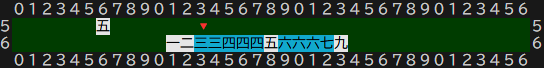

# ■各プレイヤーのデッキ(手牌・副露牌・抜きドラ牌・捨て牌(川))とメッセージの表示について考察する

## ◆デッキの回転
- 手牌(Concealed Hand)・副露牌(melded/called Tile)・抜きドラはそれぞれ独自の回転マッピングを持ちこれを行う
- マッピングの為に必要な配列は4次元配列(または3次元配列+X,Y構造体) 3次元配列の内訳は局開始場・場位置・各場の俯瞰位置、それに位置情報(col\[x\],row\[y\]) これは卓の位置が固定の為です つまり洗牌の充填を開始する位置は卓の位置から固定だからです
- 手牌・副露牌・抜きドラ・捨て牌のベクター配列→牌属性(情報)\{空牌、表示非表示または牌の裏表の判断\}→\[場の位置(4つ)→マッピングテーブル→スクリーン(文字列テーブル)\]→コンソール表示
- つまり卓位置→局開始位置→局移行場位置→各場の俯瞰位置を実現する
- 空牌とは表示しない牌で複数の副露牌の空間や手牌と自摸牌など牌間を1つ開けるために使う(visible属性)

## ◆抜きドラ(北抜きドラ／花牌・季節牌抜きドラ)
- 抜きドラは副露牌の上の段(手前から2段目)に表示する
- これは下段のみだと手牌のスペース(表示領域)がなくなるからです
- 右端から連続して表示(スペース無し)
- 表示抜きドラは***ソート***しない
- 抜きドラに必要な表示領域は季節牌・花牌なしなら3人麻雀で北ドラの4、季節牌・花牌ありなら8+4の12牌分 4人麻雀の場合は季節牌・花牌無しなら0牌、アリなら8牌分必要です

## ◆手牌
- 手牌は左から12番目の位置から右に充填されます(13牌+自摸牌の最大14牌{副露されると減っていく})
- 自摸牌は手牌(他のプレイヤーから隠している牌)から1つ空白を入れた左の位置に表示
- 手牌は設定により理牌されない場合があるが内部的には副露牌候補や聴牌や上がり牌を計算するために理牌されたものを持つ
- 副露された場合その牌を除いて左詰めにする
- 切られた牌が手牌内か自摸牌切りか判るようにアニメーションさせる
- 切る牌は手牌の上の行の「🔻」で表示
- 切る牌の選択はキーボードの1～0とq,w,e,rまたは矢印キーまたはh(左),l(右){vim手法}で「▽」を移動可能
- 切る牌の決定はエンターキー

## ◆副露牌
- 副露牌は手牌と同じ行の右端から順に表示する
- 副露された順番に右から1つ空白を開けて続けて左に表示する
- 副露牌に必要な表示領域は15牌分

## ◆捨て牌(川)
- 6牌づつ3段にして表示する
- 捨て牌は副露を4回しても18牌を越えることはない
- 副露で取られた牌は背景シアン色
- リーチ宣言牌(他家に副露で取られた場合は次のr捨て牌)は背景マゼンタ色 (通常は横に傾けた牌にするができないので色で区別)

## ◆メッセージ(文字表示)で副露(チー、ポン、カン)可否表示、リーチ、フリテン、アガリの表示
- 自家の時のみ表示なのでマッピングは不必要
- x21,y22から右にチー、ポン、カンをそれぞれの間は空白を開けて文字表示
- チー、ポン、カンの位置は固定
- 選択状態は背景赤に白字で表現、複数選択可能の場合は背景白の黒字で表現する
- 複数選択可能時は矢印キーまたはhキー(左),lキー(右)に移動できる
- Escキーでキャンセルする
- リーチはx22,y20から右に表示する
- アガリはリーチから1つ空白をあけて表示　背景赤に白字で表現
- フリテン(振り聴)はアガリから1つ空白をあけて表示　背景赤に白字で表現
- 決定はエンターキー

## ◆チー、ポン時の副露牌の指定
- 他に副露の選択が無い場合はチー、ポン、カンの「🔻」指定時に副露処理する
- 副露しない場合はEscキーでキャンセル
- ※チー、ポンの場合は以下
- 2つの「🔻」を使って表現
- 副露可能牌は背景色シアン色で表示
- 選択中の牌は「🔻」 決定はエンターキー
- 選択一つ目の時はEscキーでキャンセル可能
- 2つ選択しエンターキーで決定
- 赤ドラを副露するかしないか選択できるようにこの処理は必須
- 副露した牌の相手の川から持ってきた牌は背景シアン色にする

※チーの時の牌指定 
選択可能牌がシアン色で表現される 初期の選択🔻は最左に表示 
 
選択したら背景色白色にする 選択可能牌だけ背景シアン色にする 
 
初期の選択🔻は最左に表示 
 
 
※赤ドラが含まれている場合 
 
赤ドラか通常の５か選択できる 
 

## ◆チー、ポン、カンの副露牌の表示
- 相手の川から持ってきた牌は背景シアン色にする(相手の川の中の取ってきた牌もシアン色)
- チーは左、ポンは上家は左、対面は中、下家は左を背景シアン色にする
- チーの場合持ってきた背景シアン色の牌以外は***ソート***する(左から若い番号)
- ポンの場合は問題ない
- カンの場合、対面から関した時は左から2番目をシアン色の牌にする あとは背景シアン色にするのはポンと同じ

## ◆副露時の相手の川牌の表示
- 相手の川の副露された牌は背景シアン色で表現

## ◆リーチ棒の表現
- リーチ棒は背景白7つと中央に🔴のユニコード絵文字を使用する
- 位置はx18,y16から右に5牌分を使う

## ◆マッピング
- 手牌、副露牌、抜きドラ牌、捨て牌(川)、リーチ棒の5つの領域はそれぞれ独自のマッピングが必要
- 手牌と副露牌は13+sp+1牌と4x4+spx3だと同行なので重なるため最小限の配列とマッピングが必要