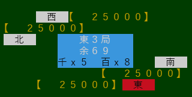
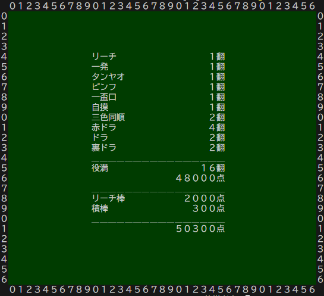
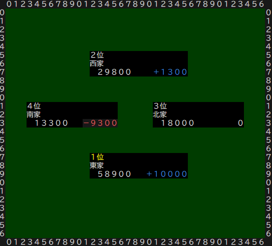
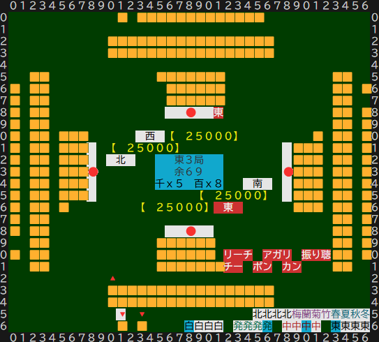

# 卓情報表示

## ■基本情報(卓上表示)
文字色指定なし、背景色濃緑色(\x1b[48;2;0;60;0m)
- 局情報
- 残牌数表示
- リーチ積棒表示
- 連荘積棒表示

----

- 点数表示 7桁表示で【】で囲う 背景卓面色、文字色黄色 リーチ時にはリアルタイムで千点を減産して表示する

- 自風位置表示 自風文字色を黒色自風背景色を白色

----

- 牌選択待ち(手番) 手番表示には表示文字色を黒色から赤色へ自風背景色を白色から赤にする

- 鳴き選択待ち

----

## ■アガリ・流局情報

- 途中流局の表示 トリプルロン(三家和)、四風連打、四家立直、九種九牌、四開樌 また途中流局時には点移動表示はしない
- アガリの場合 頭ハネ(ダブルロン時)、トリプルロン(三家和)に対応
- ダブロン時リーチ棒は上家取り
- ダブルロン時は一人ずつ役とアガリ点の表示をする
- プレイヤー名と親か子かと役と(符数)と翻数とその点を表示 加えて積リーチ棒の加点 加えて積棒の加点 そして総合点を表示
- 役名の最大数は10つ リーチ、一発、タンヤオ、ピンフ、三色同順、一盃口、自摸、赤ドラ、ドラ、裏ドラ

---
---
---
## ■点移動表示

- 局順位表示
- アガリ時の場の状態を表示し、加点前と加点後を表示する(矢印などは特に使わない)
- 表示内容は上から順に順位・名前・現時点の点・加減点
- 表示位置は上・下・左・右にボックスで表示する
- 1位だけ文字色は黄色
- 加点は青色、減点は赤色
- それぞれのプレーヤー情報の背景は黒色

## 卓位置と起家の表示

- 卓の原点位置は🔺で表現する　位置は山牌の左端直上
- 起家は背景色赤色「東」で表現する　位置はリーチ棒の左