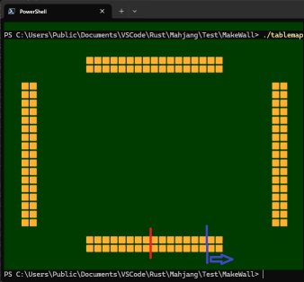

# ■牌山・王牌について考察する

## [◆牌山(the wall)](#牌山)
### 〇牌山の回転
- 正方形ではない雀卓表示
## [◆自摸山(live wall)と王牌(dead wall)](#王牌)
### 〇王牌の処理
- 嶺上牌とドラ表示牌
### 〇ドラ表示牌の処理
- Mod2==0
## [◆配牌(the initial draw)](#配牌)
### 配牌の考察
- 起家(First Dealer)から4牌づつ3回配牌する
- その後1牌づつ配牌し親(起家)が2枚目を配牌して配牌は終了(現実ではチョンチョンする)
----
----
----
## <a id=牌山>◆牌山(the wall)</a>
### 〇花牌・季節牌(抜きドラ)の対応
- 通常は17牌を2段(合計34牌)を積むが、花牌・季節牌を入れた時は18牌の2段になる
----
### 〇牌山の回転
- 場決めからの再現をするので牌山の充填位置は場決め時と親流れの場ごとに変わる(*※重要*)
- 正方形ではない雀卓表示(37x27)

この回転を実現するには専用のマッピング処理が必要

回転No.に対し0-3の4通りのマップを作り表示処理をする

3人麻雀の時は0-2の3通りのマップが必要

牌山の表示の関係から4人と3人麻雀はそれぞれ独自のマッピングが必要

このマッピング処理は牌山、手牌、捨て牌の3つ毎に必要

マッピング実現のためには2次元配列と座標構造体が必要

- 牌山のマッピングに必要な牌数

単に表示するだけなら17牌の2段でいいが王牌処理と季節牌に対応する為には18牌2段にしなければならない

牌領域の増加分は4牌分になる

3人麻雀の時は季節牌を入れると19牌2段1つと18牌2段2つになる

----
## <a id=王牌>◆自摸山(live wall)と王牌(dead wall)</a>
### 〇王牌の処理
- 自摸山と王牌の分離
  - 王牌の分離は3種類ある
    - 2つのサイの目の合計が2-6の場合
      - 起家から見たサイの目の位置の右からサイの目を分離する
      - 王牌の7牌2段に満たない分は右(上家)の自摸山で補填する
      - この補填は上家の左から王牌の不足分を補填する
      - 配牌のマップの仕様上、残りの山牌は空白を1つ開けて右へずらす
      - 3人麻雀の時は起家(東家)のサイの目7の時は王牌切りの必要はない
      - 西家サイの目7の時は王牌切りの必要はない
      - 例：東家サイの目5の時
      - 
      - 例：東家サイの目9の時
      - 
- 嶺上自摸牌とドラ表示牌
  - 嶺上自摸牌とドラ表示牌は別々の配列として処理した方が良い
- 王牌プログラム実装時の考察
  - Pai配列を3つにする
  - 自摸山、王牌の嶺上自摸部・ドラ表示牌部の3つに分ける
----
### 〇ドラ表示牌の処理
- Mod2==0の判定でループでドラ表示牌を適用する
- ドラ表示が確定したら卓全体の牌にドラ適用とドラ表示処理(下線を付ける)をする
----
## <a id=配牌>◆配牌(the initial draw)</a>
### 配牌の考察
- 起家(First Dealer)から4牌づつ3回配牌する
- その後1牌づつ配牌し親(起家)が2枚目を配牌して配牌は終了(現実ではチョンチョンする)
- 配牌1回ごとに卓全体表示してプログラムに不正が無いことを示す
- 配牌時は理牌しない
- 理牌設定している時は配牌完了時と手牌から牌を切ったとき、チー・ポン・カン表示が完了したときに理牌を行う
----

